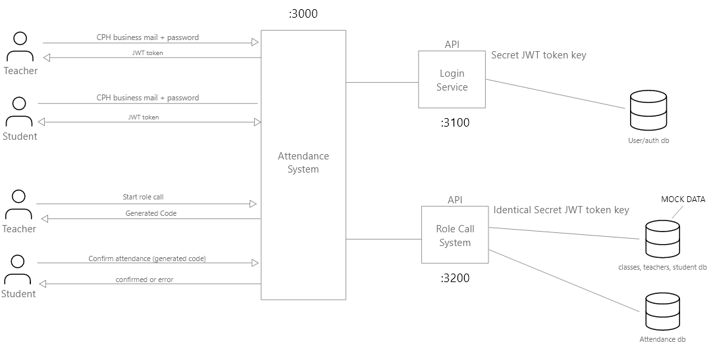

# Attention System
This system is created for the exam in Large Systems Development. 

## Description
This system consists of two API's and a small react application. 
It can handle authentication (passwords are hashed), authorization (JWT), creation of students and teachers, student registration with "attendance codes" (4 characters) during rolecalls, time to live on attendance codes and showing statistics. 

We have used a microservices architechture very close to the one below: 



**OBS** the system does not use three database servers, but instead share one instance and arrange the data under three different database names in MongoDB. Also the text by the lines of the clients are **Not** actual parameter names, just explanations of the data being transferred. **Also** the statistics endpoints are not represented in the image, but are retrieved through the role call API.

## **To run**

-----------------------------

### **prerequisites**
Make sure you have **nodejs** (and npm) installed. 
If you do not have nodejs you can download it [here](https://nodejs.org/en/download/), you get npm as well when you download it. 

You will need an instance of MongoDB running. If you do not wan't to download, install and run in your own enviroment you can use docker. You can get it from docker with this command:<br> 
```docker run -d -p 27017:27017 --name MongoDB mongo:5.0.4``` <br>

-----------------------------

- Clone this repository 
- In the ```user-api``` and ```rolecall-api``` folders, rename the files ```example.config.js``` to ```config.js``` and change mongodb host and port if nessesary to fit your enviroment. You can also update the JWT secret to a realistic value, but this is optional.
- Navigate to the ```user-api``` folder in CLI and run command ```npm install``` and then ```npm start``` 
- Navigate to the ```rolecall-api``` folder in CLI and run command ```npm install``` and then ```npm start```
- Navigate to the ```user-api\database\seed``` folder in cli and run command ```node seedDB.js``` <br>
**OBS** - this might take some time (max. 2 minutes)
- Navigate to the ```attendance-system``` folder in CLI and run command ```npm install``` and then ```npm start``` <br>
**OBS** - this will open a browser window with the application

Now you should have a browser windows opened on URL: http://localhost:3000/, if not, then go to http://localhost:3000/ .

We recommend having two browser windows opened on http://localhost:3000/ . Then you can log in as both a student and teacher. 

Now you can interact with the system, use the test users below. 
Not all endpoints are available through the frontend, if you want to explore all the endpoint go to the [API](##api) section in this readme.

### TEST USERS
| Email | Password |
|-------|----------|
|teacher@teacher.dk|teacher|
|student@student.dk|student|


### Troubleshoot
| Error | Solution |
|-------|----------|
|Error message including **bcrypt** | Navigate to the ```user-api``` folder in CLI and run command ```npm uninstall bcrypt``` and then ```npm install bcrypt```|
| Error message including **mongo** | Make sure you have a MongoDB instance running without username and password (see [Prerequisites](###prerequisites)). Also make sure you config file matches your MongoDB instance |

## **API**
We've been using Insomnia ([download](https://insomnia.rest/download)) to test our endpoints. If you have Insomnia installed you can import the json file from ```request-collection``` by pressing ```application > preferences``` and then selecting the tab ```data``` and pressing import. 

### **Endpoints**
#### **User API**
#### Healthcheck: <br>
```localhost:3100/```
##### returns 
``` json
{
	"status": "OK",
	"message": "Hello from Users API"
} 
```

#### Create Student: <br>
```localhost:3100/users/student/create```

##### Request body
``` json
{
	"email": "johndoe@student.dk",
	"pwd": "super-secret",
	"firstname": "John",
	"lastname": "Doe",
	"dob": "1985-03-10"
}
```

##### returns 
``` json
{
	"status": "200 - OK",
	"message": "The user was saved to the database.",
	"insertedId": "<some-id-string>"
}
```

#### Create Teacher: <br>
```localhost:3100/users/teacher/create```

##### Request body
``` json
{
	"email": "johndoe@teacher.dk",
	"pwd": "super-secret",
	"firstname": "John",
	"lastname": "Doe",
	"dob": "1985-03-10"
}
```

##### returns 
``` json
{
	"status": "200 - OK",
	"message": "The user was saved to the database.",
	"insertedId": "<some-id-string>"
}
```

#### Login Teacher or Student: <br>
```localhost:3100/login```

##### Request body
``` json
{
	"email": "teacher@teacher.dk",
	"pwd": "teacher"
}
```

##### returns 

HTTP header<br>
```Authorization: JWT: <some-token-string>```

Body
``` json
{
	"status": "200 - OK",
	"message": "login successful",
	"user_role": "TEACHER"
}
```


#### **Rolecall API**
#### Healthcheck: <br>
```localhost:3200/```
##### returns 
``` json
{
	"status": "OK",
	"message": "Hello from Rolecall API"
}
```

#### Start Lecture: <br>
```localhost:3200/lecture/start```

Request must include JWT token from a teacher login response header. 

ID and code is examples.

##### Request body
``` json
{
	"lecture_id":"61be6ec517835b863eae8b24",
	"ttl": 300
}
```

**ttl** is how long student have to register in seconds

##### returns 
``` json
{
	"status": 200,
	"message": "OK",
	"code": "rk5f"
}
```

#### Register attendance: <br>
```localhost:3200/student/checkin```

Request must include JWT token from a student login response header. 

ID and code is examples.

##### Request body
``` json
{
	"lecture_id": "61be6ec517835b863eae8b24",
	"attendance_code": "rk5f"
}
```

**ttl** is how long student have to register in seconds

##### returns 
``` json
{
	"status": "200: OK",
	"message": "The student was succesfully checked in to lecture with id: 61be6ec517835b863eae8b24"
}
```


